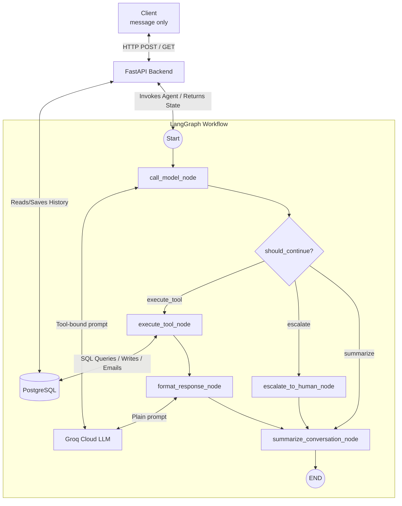

# RT Communication Agent Architecture

This system is a message-only chat assistant for RT Communication, a bulk message services provider (masking and non-masking SMS). The client sends only one text message per turn. FastAPI receives the message, LangGraph routes the request, Groq Cloud LLM determines whether to search the knowledge base for FAQs, save collected information (lead generation), or escalate. PostgreSQL stores conversations, collected data, session summaries, and user auth codes.

## 1.1 System Overview

## 1.2 Conversation Flow Example

Guest message:
"I want to buy 10,000 non-masking SMS for my business."

1. Client calls POST /api/chat/{conversation_id}/message with the message.
2. FastAPI appends the user text to conversation history and invokes LangGraph.
3. `call_model_node` sends the text to Groq Cloud. The model determines it should gather details for lead generation.
4. The model uses `save_collected_information` to store the desired SMS volume and type in the database.
5. The model responds directly asking for the business name and contact info.
6. As the conversation progresses, `summarize_conversation_node` compresses older messages into a `session_summary` to save LLM tokens.

## 1.3 LangGraph State Design

| Field            | Type                     | Why it is needed                                            |
| ---------------- | ------------------------ | ----------------------------------------------------------- |
| conversation_id  | str                      | Links each turn to one chat thread.                         |
| messages         | List[BaseMessage]        | Gives model the latest user text and limited context.       |
| intent           | Optional[str]            | Extracted from tool choices (inquiry/lead/escalate).        |
| extracted_params | Optional[Dict[str, Any]] | Holds parameters for API schema compatibility.              |
| missing_fields   | Optional[List[str]]      | Holds missing required params for API schema compatibility. |
| tool_result      | Optional[Any]            | Holds tool execution output for final response formatting.  |
| final_response   | Optional[str]            | Stores guest-facing response generated by formatter.        |
| escalate         | bool                     | Marks when request must be handed to a human.               |
| session_summary  | Optional[str]            | Stores a rolling summary of the conversation.               |

## 1.4 Node Design

Graph uses 5 nodes.

1. call_model_node: Uses Groq LLM to determine intent and evaluate if enough context is present to route to a tool.
2. execute_tool_node: Runs the requested tool (RAG search, save info, send email, escalate).
3. format_response_node: Uses a plain LLM to convert raw tool output into a friendly summary.
4. escalate_to_human_node: Hard handoff node triggering human intervention protocols.
5. summarize_conversation_node: Condenses long chat histories into a rolling summary.

## 1.5 Database Schema Design

### 1. conversations
- id BIGSERIAL PRIMARY KEY
- conversation_id TEXT NOT NULL
- role TEXT NOT NULL
- content TEXT NOT NULL
- intent TEXT NULL
- escalate BOOLEAN NOT NULL
- created_at TIMESTAMPTZ NOT NULL

### 2. collected_data
- id BIGSERIAL PRIMARY KEY
- session_id TEXT NOT NULL
- key TEXT NOT NULL
- value TEXT NOT NULL
- created_at TIMESTAMPTZ NOT NULL

### 3. user_auth_codes
- id BIGSERIAL PRIMARY KEY
- email TEXT NOT NULL
- code TEXT NOT NULL
- created_at TIMESTAMPTZ NOT NULL

### 4. session_summaries
- id BIGSERIAL PRIMARY KEY
- session_id TEXT UNIQUE NOT NULL
- summary TEXT NOT NULL
- updated_at TIMESTAMPTZ NOT NULL

## Setup & Running (Local)

1. Create and activate a virtual environment.
2. Install dependencies:
   `pip install -r requirements.txt`
3. Create local env file:
   `cp .env.example .env`
4. Set `DATABASE_URL` and `GROQ_API_KEY` in the `.env` file.
5. Apply database schema:
   `psql "$DATABASE_URL" -f sql/schema.sql`
6. Start the API server:
   `uvicorn api.main:app --reload`
